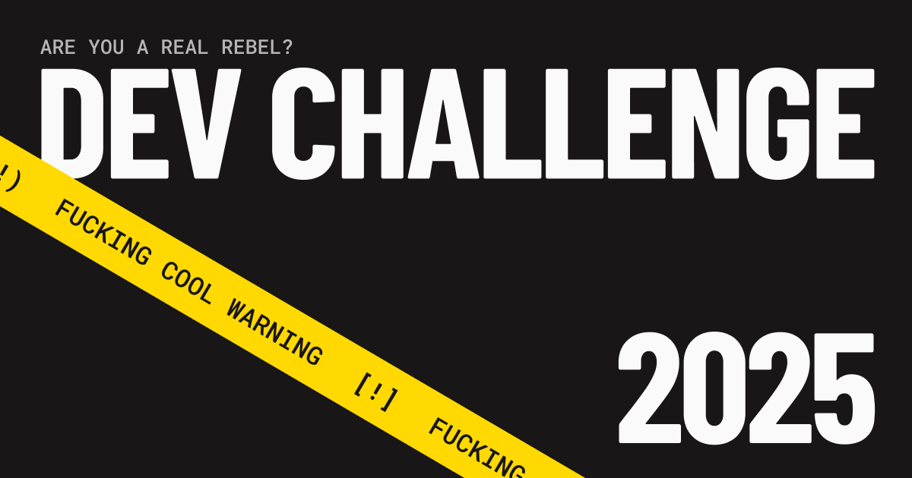

# JOYCO Dev Challenge by Alejo Pequeño



## Getting Started

1. Fork the project on Basehub:
   - Hit up **Basehub** and fork the repo: [Public Repo](https://basehub.com/joyco/2025-dev-challenge)
   - Basehub will hook you up with a personal token for your repo
2. Clone the repo locally:
   ```bash
   git clone https://github.com/chad-guy/dev-challenge-joyco.git
   cd dev-challenge-joyco
   ```
3. Install dependencies:
   ```bash
   pnpm install
   ```
4. Create a `.env` file in the root directory with:
   ```
   BASEHUB_TOKEN="TOKEN"
   ```
   **Pro tip:** Replace "TOKEN" with the personal token Basehub gave you.

---

Thanks for reading 🙃

JOYCO x Alejo
